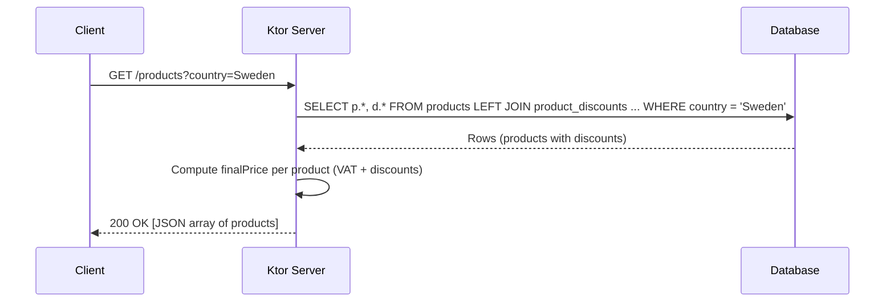
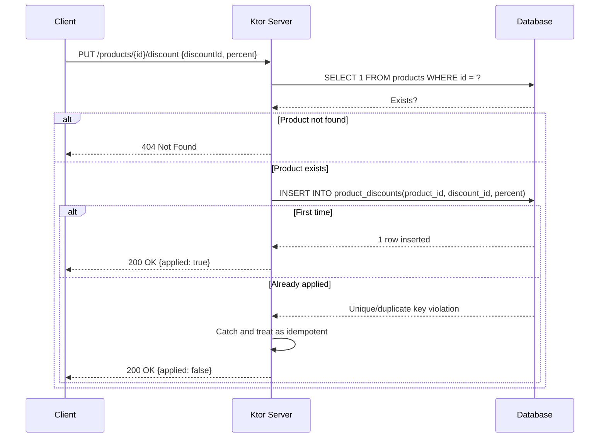

### Architecture Overview

This Ktor service provides a simple Product API backed by a relational database. It stores products and applied discounts, calculates final prices including country VAT, and enforces idempotent, concurrency-safe discount application at the database level.

#### Tech stack
- Ktor (server, routing, content negotiation)
- JDBC (raw) with H2 for local/dev/tests and PostgreSQL for production
- Jackson + Kotlin serialization support for JSON

#### Data model
- Table `products(id, name, base_price, country)`
- Table `product_discounts(product_id, discount_id, percent)`, with primary key `(product_id, discount_id)`

The composite primary key enforces the constraint: the same `discount_id` cannot be applied more than once to the same product.

#### VAT
VAT rules are fixed as per requirements:
- Sweden: 25%
- Germany: 19%
- France: 20%

Final price formula used in responses:
```
final = basePrice × (1 - totalDiscount%) × (1 + VAT%)
```
Rounded to 2 decimals.

#### Concurrency and idempotency
The `PUT /products/{id}/discount` endpoint attempts to insert a row into `product_discounts`. Under contention, the first request will succeed; subsequent concurrent inserts with the same `(product_id, discount_id)` will fail with a unique/duplicate key violation, which is caught and treated as an idempotent success (no state change, `applied=false`). This guarantees database-level enforcement even under heavy concurrent load.

### Sequence diagrams

#### GET /products


#### PUT /products/{id}/discount


### Important notes
- The schema is created on startup, and a few products are seeded if the table is empty.
- For production, configure PostgreSQL by setting `db.embedded=false` and providing connection settings in `application.yaml`.
- The concurrency test (`ProductApiTest.applyDiscount_isIdempotent_underConcurrency`) simulates many simultaneous HTTP PUTs against the same product/discount and asserts only one persisted application.

### Example curl commands

- List products for Sweden:
```bash
curl -s "http://localhost:8080/products?country=Sweden"
```

- Apply a discount idempotently to product `swe-001`:
```bash
curl -s -X PUT "http://localhost:8080/products/swe-001/discount" \
  -H "Content-Type: application/json" \
  -d '{"discountId":"BLACKFRIDAY2025","percent":10.0}'
```

Re-running the same PUT with the same `discountId` will return `200 OK` with `{ "applied": false }` after the first successful application.
